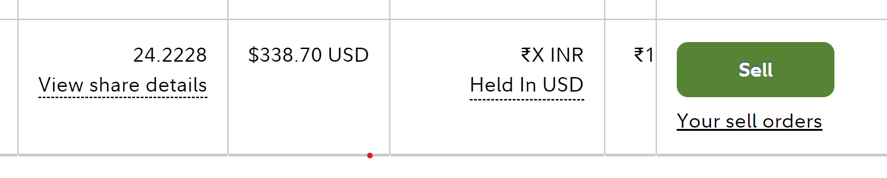
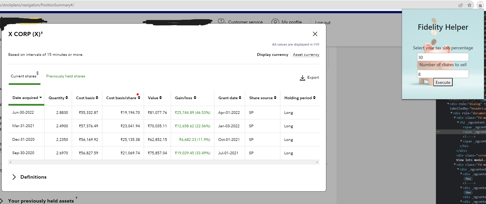

# FidelityHelper
Tired of manually calculating how much tax you'll have to pay when you withdraw a particular amount of stocks from Fidelity. This chrome extension will help you get an overview before withdrawing a said amount.

### Why do we need this? 

- Fidelity website is built keeping in mind US Customers as has no taxation visibility for Indian customers. 

- Before selling some number of stocks, it is very tedious for a customer to calculate the tax which he/she will have to pay for the redeemed amount. 

 
This extension will give the user an estimate of how much tax he/she will have to pay if they redeem a certain amount of stock keeping in mind the current tax laws in India and the customer’s slab rate. 

 
### How to use?

- Clone this repo
- Enable developer mode and load the extension using "Load Unpacked" option. More info [here.](https://support.google.com/chrome/a/answer/2714278?hl=en#:~:text=Go%20to%20chrome%3A%2F%2Fextensions,the%20app%20or%20extension%20folder.)
- Goto fidelity stock section and click on "View Share Details" option.

- Open the chrome extension popup and enter your tax slab rate and the number of stocks you wish to withdraw. 

- Click Execute and you'll see that the extension will populate a new column in the table showing tax applicable if you sell on the current date for a particular entry.
- Also, it will show cumulative tax according to the number of stocks you wish to sell.

### How does it work?
The extension picks up data from “View share details” modal in fidelity using content scripting and processing it to get the required data. For STCG (<24 months holding), the user is taxed at slab rate.  For LTCG (>=24 months holding), the user is taxed at 20% with indexation benefit. The data is then fed back to the page and displayed to the user. 

### Contributing
We welcome contributions. Please make a detailed PR with your change and we will be happy to review.